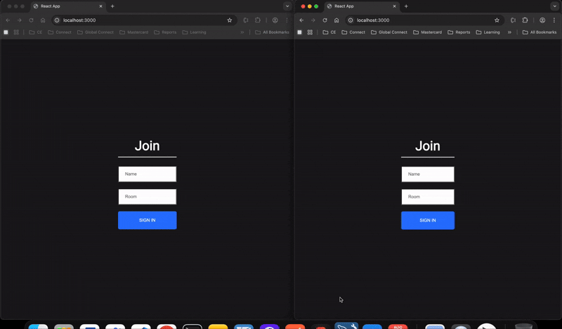

<div align="center">
  
</div>


<div align="center">
 
 
    
    
    
</div>

# Realtime Chat Application

A chat app to chat with like-minded people in a community.

[Checkout the demo](https://classy-peony-9eeb9a.netlify.app/)




## <a name="features">🔋 Features</a>

👉 Join a community/room of choice

👉 Chat using emojis

👉 See who's online


## Tech Stack

**Framework:** ReactJS, Express.js

**Communication:** Socket.io


## <a name="quick-start">🤸 Quick Start</a>

Follow these steps to set up the project locally on your machine.


**Client Installation**

Install the project dependencies using npm:

```bash
cd client
npm install
```


**Running the Client**

```bash
npm start
```

**Server Installation**

Install the project dependencies using npm:

```bash
cd server
npm install
```


**Running the Server**

```bash
npm start
```
